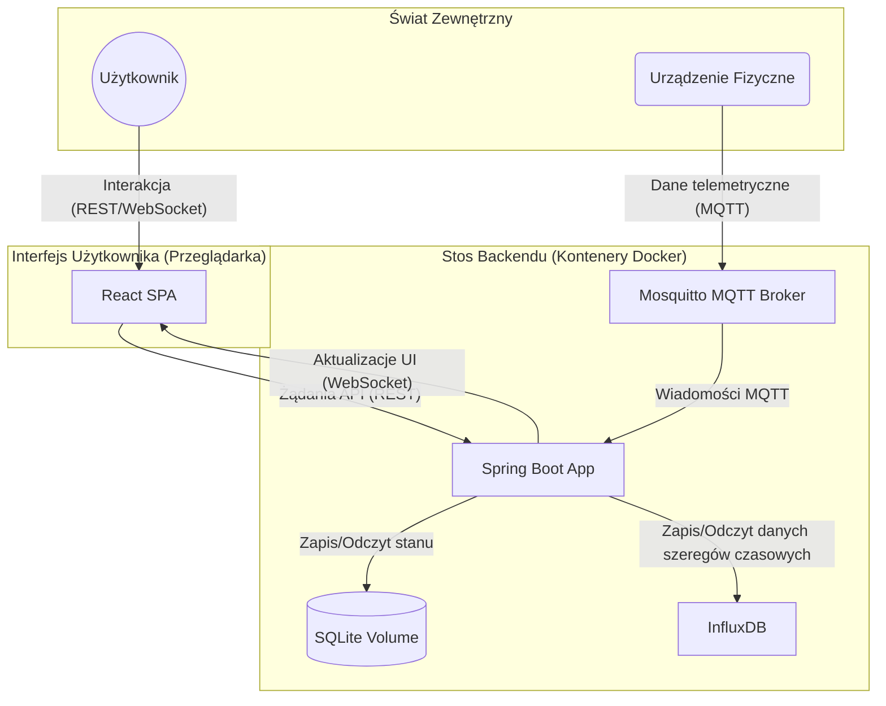

# IoT Simulation Platform

[](https://opensource.org/licenses/MIT)

Pełnostackowa platforma programistyczna do symulacji i wizualizacji interakcji w systemach Internetu Rzeczy (IoT). Projekt demonstruje nowoczesną, sterowaną zdarzeniami architekturę do przetwarzania danych i automatyzacji w czasie rzeczywistym.

Platforma pozwala użytkownikom na definiowanie urządzeń wirtualnych, integrację danych z fizycznego sprzętu (poprzez MQTT), tworzenie reguł automatyzacji (logika IF-THEN) oraz wizualizację danych historycznych i bieżących na interaktywnych wykresach.


---

## Kluczowe Funkcjonalności

-   **Zarządzanie Urządzeniami Hybrydowymi:** Tworzenie i zarządzanie urządzeniami wirtualnymi obok fizycznych.
-   **Dashboard w Czasie Rzeczywistym:** Dynamiczny interfejs zbudowany w React i Material-UI, aktualizowany na żywo poprzez WebSockets.
-   **Silnik Reguł:** Backendowy silnik, który przetwarza zmiany stanu urządzeń i uruchamia akcje na podstawie zdefiniowanych przez użytkownika reguł.
-   **Integracja MQTT:** Bezproblemowa integracja danych z urządzeń fizycznych (np. ESP32) komunikujących się przez MQTT.
-   **Wizualizacja Danych Historycznych:** Przechowywanie i wyświetlanie danych szeregów czasowych z czujników na interaktywnych wykresach z wykorzystaniem InfluxDB.
-   **Konteneryzacja:** Cały stos technologiczny backendu (aplikacja Spring Boot, broker Mosquitto, baza InfluxDB) jest zarządzany przez Docker Compose.

---

## Stos Technologiczny

| Kategoria       | Technologia                                                               |
| :-------------- | :------------------------------------------------------------------------ |
| **Backend**     | Java 21, Spring Boot 3 (Web, JPA, WebSocket, MQTT Integration)            |
| **Frontend**    | React 19, TypeScript, Vite, Material-UI, Zustand, Recharts, StompJS      |
| **Bazy Danych** | SQLite (konfiguracja, stan), InfluxDB (dane szeregów czasowych)           |
| **Broker**      | Eclipse Mosquitto (w kontenerze Docker)                                   |
| **Infrastruktura** | Docker & Docker Compose                                                   |

---

## Architektura Systemu

System opiera się na architekturze z wyraźnym podziałem na frontend, backend i infrastrukturę. Komunikacja jest sterowana zdarzeniami.



---

## Uruchomienie Projektu

### Wymagania Wstępne

-   [Docker Desktop](https://www.docker.com/products/docker-desktop/)
-   [Node.js](https://nodejs.org/) (v20.19+ lub v22.12+)
-   [Java JDK](https://www.oracle.com/java/technologies/downloads/) (v21)
-   [Apache Maven](https://maven.apache.org/download.cgi)

### Instalacja i Konfiguracja

1.  **Sklonuj repozytorium:**
    ```bash
    git clone https://github.com/twoja-nazwa-uzytkownika/iot-simulation-platform.git
    cd iot-simulation-platform
    ```

2.  **Uruchom stos backendu:**
    To polecenie zbuduje obraz aplikacji Spring Boot i uruchomi wszystkie kontenery (Aplikacja, Broker Mosquitto, InfluxDB).
    ```bash
    docker-compose up --build
    ```
    -   Backend będzie dostępny pod adresem `http://localhost:8081`.
    -   Broker MQTT nasłuchuje na porcie `1883`.

3.  **Uruchom aplikację frontendową:**
    Otwórz nowy terminal, przejdź do katalogu `frontend`, zainstaluj zależności i uruchom serwer deweloperski.
    ```bash
    cd frontend
    npm install
    npm run dev
    ```
    -   Frontend będzie dostępny pod adresem `http://localhost:5173`.

### Użycie Platformy

1.  **Otwórz interfejs** w przeglądarce pod adresem `http://localhost:5173`.
2.  **Dodaj Urządzenie Wirtualne:** Użyj formularza "Add Virtual Device", aby stworzyć nowe symulowane urządzenie (np. SENSOR lub ACTUATOR).
3.  **Symuluj Zdarzenia:**
    -   **Ręcznie:** Użyj formularza "Event Simulator", aby ręcznie wywołać zmianę stanu dla dowolnego urządzenia.
    -   **Przez MQTT:** Opublikuj wiadomość JSON na brokerze MQTT (`localhost:1883`).
        -   **Temat:** `iot/devices/{ID_TWOJEGO_URZADZENIA}/data`
        -   **Przykładowy Payload:** `{"sensors": {"temperature": 25.5, "humidity": 48.2}}`
        -   *Uwaga: Jeśli urządzenie o podanym ID nie istnieje, zostanie utworzone automatycznie jako urządzenie fizyczne.*
4.  **Twórz Reguły Automatyzacji:** Użyj sekcji "Automation Rules", aby zdefiniować logikę IF-THEN pomiędzy urządzeniami.
5.  **Przeglądaj Historię:** Kliknij na kartę dowolnego urządzenia typu SENSOR, aby otworzyć okno z wykresem jego danych historycznych i bieżących.

---

### Przykład Przepływu Danych (Zdarzenie MQTT)

1.  Urządzenie fizyczne publikuje payload JSON na temat `iot/devices/esp32-salon/data`.
2.  Kontener Mosquitto otrzymuje wiadomość.
3.  Backend Spring Boot, subskrybujący temat `iot/devices/+/data`, otrzymuje wiadomość.
4.  `MqttMessageService` wyodrębnia `deviceId` i deleguje zdarzenie do `DeviceService`.
5.  `DeviceService`:
    a. Zapisuje lub aktualizuje stan urządzenia w bazie SQLite.
    b. Wypycha zaktualizowany obiekt urządzenia do frontendu przez WebSocket.
    c. Wywołuje `TimeSeriesService`, aby zapisać dane w InfluxDB.
    d. Uruchamia `SimulationEngine` z nowym stanem urządzenia.
6.  `SimulationEngine` sprawdza, czy zmiana stanu aktywuje którąś z reguł. Jeśli tak, wykonuje zdefiniowaną akcję (co może prowadzić do rekurencyjnego wywołania kroku 5d dla innego urządzenia).
7.  Frontend React, po otrzymaniu wiadomości WebSocket, aktualizuje swój globalny stan Zustand.
8.  Komponenty subskrybujące stan (np. lista urządzeń) automatycznie renderują się ponownie, aby odzwierciedlić zmianę.

---

## Licencja

Projekt jest udostępniany na licencji MIT. Zobacz plik [LICENSE](LICENSE) po szczegóły.
